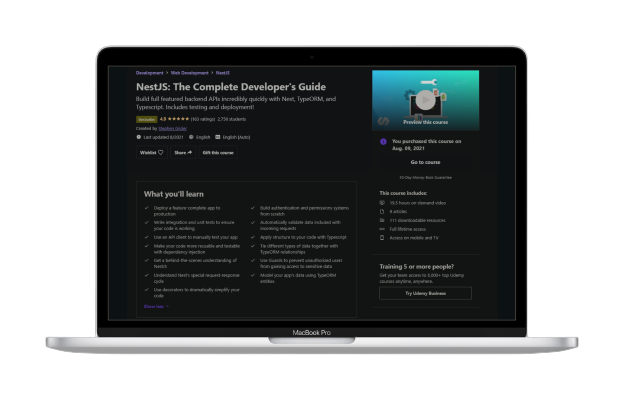

<div align = "center">

  
</div>


<h4 align="center" >
  NestJS: The Complete Developer's Guide
</h4>

<div align = "center">

  
</div>


<div align="center">
<!--    -->
</div>


 <h2 align = 'center'>Technologies:  </h2>
<p align="center">
  
   
  


</p>

<p align="center">
  <a href="https://wa.me/+46793351364?text=tja%20Jakob%20jag%20gillade%20dit%NestJs%20API%20">Link Me   |   </a>
  <a href="https://www.udemy.com/course/nestjs-the-complete-developers-guide20">Course</a>
</p>


##
```
Authors:  {jakob yaro }
```

  
  
  ```
Status:  Done✅ ( 21/08-2021)
```

  
  

  


